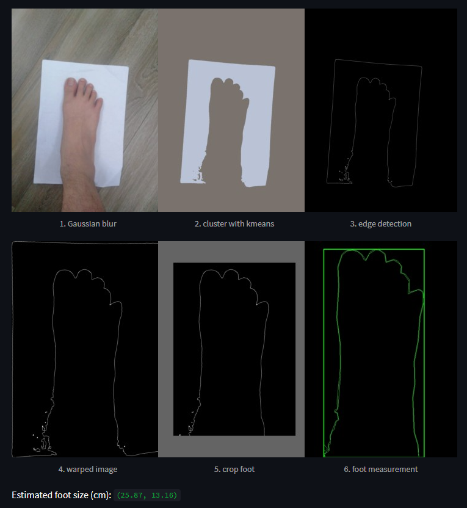

##Mini-project: Foot size estimation  ##  

------------------------------------------------------------------------------------------------------------------------
A demo website using Streamlit with the following functionalities:

- upload images

- select option: measure width or height

- foot and paper segmentation: possibly uses image processing techniques or DL-based approaches

- visualize intermediate results: segments of foot, paper, paper's corners...

- output width, height and corresponding size

How to Evaluate?
------------------------------------------------------------------------------------------------------------------------
- Clone the repo: git clone https://github.com/hoanganh27042001/FootSizeEstimation.git
- cd to the cloned directory
- Install required packages: pip install -r requirements.txt
- run the command: streamlit run main.py

Working approach
------------------------------------------------------------------------------------------------------------------------
- Remove noise from original image using Gaussian Blur
- Run k-means clustering on preprocessed image for color based segmentation
- Detect the edges in clustered image.
- Find contours in Edge Detection output and filter the largest contour.
- Generate the bounding rectangle from the contour and rotate to extract paper
- Then drop 10% of the paper image to get the foot contour.
- Create the foot's bounding Box to get the height/width of Foot.
- Calculate the foot size base on the ratio between the paper and foot.
https://www.dienmayxanh.com/kinh-nghiem-hay/cach-xac-dinh-size-giay-cho-nam-gioi-don-gian-de-1357862

Limitations
------------------------------------------------------------------------------------------------------------------------
- If floor color is white, then it will difficult to segment the paper.
- Feet should not go out of the paper. 
- If there is no closed curv after edge detection, its difficult to find bounding box. Only closed curv is considered as a contour. And bounding box is generated on top of that.
- If the paper is not clearly visible (with full 4 conners), the bounding box for the paper might be wrong and the estimation might be affected.